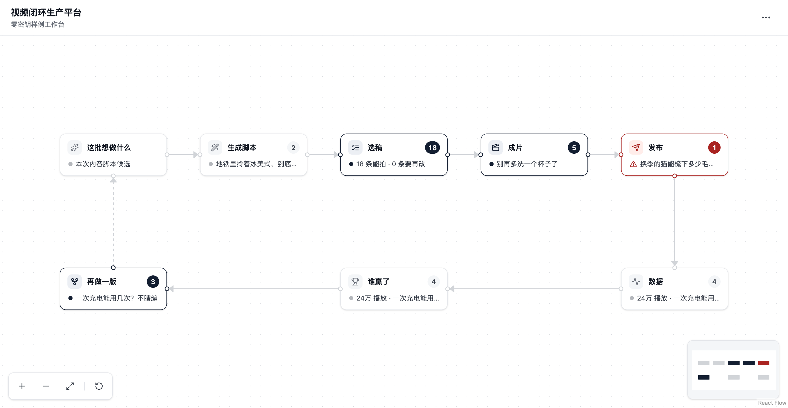

# AI 视频运营流水线

> 「50 天 50 个真实行业 AI 应用」· Day 01 · 内容运营 · MIT

把一条短视频的一生——写脚本、选稿、成片、多账号发布、数据回流、再裂变一版——收进同一条记录里。它替代的是运营团队每天在 AI 对话、飞书、群聊、硬盘和平台后台之间**手工搬运同一条视频**的活儿，不是再做一个数据报表。

零密钥就能跑通整条线；YouTube 是接了真实 API 的平台实例，不是录屏里的假接口。



## 为什么做这个

每天生产几十条视频的运营团队，真实流程通常是这样的：在 AI 对话里聊脚本 → 复制到飞书编号 → 分镜和成片散在硬盘 / NAS / 群聊 → 多个账号手工排期发布 → 平台数据手工回填表格 → 表现好的视频再翻回原脚本裂变。同一条视频的身份，在五六个工具之间断了又接。

Day 01 不重写这些工具，而是建立一个以 `Video` 为核心的业务记录，让脚本、分镜、成片、发布、数据和裂变**始终挂在同一条视频上，身份、版本和血缘不断链**。账号只是管理与发布维度，平台只是账号属性；一条视频可以投给多个账号，每个账号产生独立的数据。

## 一条视频怎么走完全程

首页就是这条流水线本身（一张拓扑锁死的节点画布），不是它的台账。八个节点，闭环在一屏内闭合：

```
这批想做什么 → 生成脚本 → 选稿 → 成片 → 发布 → 数据 → 谁赢了 → 再做一版
                 AI       等你   等你   多账号  回流   自动   带赢家基因开下一批
```

每个节点点开是一个面板，判断都在面板里做；画布只回答「现在该干什么」，等你的节点唯一高亮，其余安静。

### 现在能做什么

- **这批想做什么**：一段商品 / 受众 / 场景的 Context（文字、已有 AI 对话、网页 / 图片 / 视频地址，或最多两个 `txt/md` 文件），可选商品，决定脚本数量。图片和视频首版保留引用地址，不冒充已解析画面。
- **生成脚本**：一次生成 1–10 条角度不同的脚本候选，不会把十条草稿直接塞进正式工作台。同批开头两句互不相同，台词是能直接照拍的人话，不夹带导演指令、合规声明和字段标签。
- **选稿**：逐条比较叙事角度和前两句；整条展开看完整口播、逐镜画面、屏幕字、时长和商品事实；支持就地编辑、单条重写、多选进成片。**确定性质量门**只放行「声明可追溯 + 3 秒钩子 + 单一购买理由 + 画面能证明 + 时长达标 + 口播分镜一致」的稿，任一不过标「需修改」——它不预测爆款，也不用模型分数代替真实数据。候选默认不勾选，必须比较后主动选；「需修改」稿可以显式推进，但风险与待补证据继续跟随正式脚本。
- **成片 → 发布**：上传成片，或由外部制作模块登记本应用成片目录内的文件；选一到多个账号，每个账号一条独立 `Publication`。排期、成功、失败、未知结果、重试互不覆盖，一条失败不影响其他。真实上传前服务端和界面都要确认，默认 `private`。
- **数据 → 裂变**：按发布记录存多个时间点的指标和评论，标出流量高 / 成交高 / 双高 / 待观察；评论可选入下一轮 Context。任意视频都能裂变，子视频继承父 Context、产物引用和选中评论，裂变弹窗顶部显示父视频表现提炼（同批倍数、订单转化、高赞评论诉求），本轮变化写在依据上，不用盲写。
- **接入既有流程**：粘贴或上传外部已完成的脚本 / 分镜，或用可回灌 JSON / CSV 批量导入视频清单（提交前预览字段、冲突和缺失引用），后续流程与内置生成完全一致。
- **版本与血缘**：每次生成或编辑都创建新版本，可查看旧版本并恢复成一个新版本，不覆盖历史；父子视频关系和本轮变化可追溯。

## 30 秒跑起来

需要 Python 3.12+、Node.js、npm。共享界面已打包进 `vendor/`，不依赖任何仓库外的目录。

```bash
uv sync
npm ci
uv run video-ops demo
```

打开 `http://127.0.0.1:5173`。首次进入就有 2 个账号组、4 个账号、12 条样例视频，覆盖待脚本、待成片、待发布、发布失败、已发布、可裂变等真实状态——不需要模型密钥或平台账号。样例库带版本号：升级代码后再次启动 demo，检测到旧版本会自动重建，只影响 `output/demo.db`。

### 四个命令

| 命令 | 作用 |
|---|---|
| `uv run video-ops doctor` | 检查 Python、前端依赖、样例数据和可选连接器 |
| `uv run video-ops demo` | 零密钥样例：一条命令起 API、后台任务和网页 |
| `uv run video-ops check` | 静态检查 + 后端测试 + 前端测试 + 生产构建 |
| `uv run video-ops run` | 本地工作库 + 已配置的真实连接器 |

端口可用 `VIDEO_OPS_API_PORT` / `VIDEO_OPS_WEB_PORT` 改；含本地写入与真实发布动作，正式入口只监听 `127.0.0.1` / `localhost` / `::1`，不提供局域网公开模式。

## 不是假 demo：什么是真的，什么是样例

这个挑战反对一件事：画面很炫、流程很长、离开作者电脑就跑不起来。所以这里把话说清楚：

- **样例**（`data/sample/`）：完全合成、手写的 12 条视频，只为让任何人一条命令跑通。所有平台链接、播放、成交和评论均为样例，指标是逐条编的故事曲线，不代表任何真实成绩。
- **真实验证**（`evidence/`）：真跑过的才算，脱敏记录都在 `evidence/`：
  - 一次真实 YouTube `private` 上传 + 频道校验 + 平台状态反查 + 两次指标同步 —— [记录](evidence/2026-07-15-youtube-write-validation.md)；
  - 独立评论 token 的真实评论正文回流 + 私密视频「评论已关闭」的平台可核验空结果 —— [记录](evidence/2026-07-15-youtube-comment-validation.md)；
  - 真实模型从脱敏 Context 生成并保存可编辑的脚本与分镜 —— [记录](evidence/2026-07-14-model-validation.md)；
  - 同一商品 30 条内容门 + 真实模型越界检查 + 双视口验收 —— [记录](evidence/2026-07-15-commerce-script-upgrade.md)。
- **没有真实证据的平台能力，界面显示「未验证」，绝不写成「已打通」。**「结构通过」只表示合规、可拍、值得发布测试；「高转化」必须由真实播放、点击和成交数据证明。

当前门禁：后端 177 项测试、前端 49 项测试、生产构建，全绿（`uv run video-ops check`）。

## 架构与二次开发

后端是六边形结构，业务核心不认识任何模型商或平台——换引擎、接平台都在 `adapters/` 加文件。前端是一张拓扑锁死的节点画布。

```
src/video_ops/
  domain/        纯业务：视频、脚本、发布、血缘的模型、状态机、质量门
  application/   用例编排：一次生成、选稿、发布、数据回流、裂变
  adapters/    ★ 合同的实现：内置模板 / OpenAI / 本机 CLI 写脚本，mock / YouTube 平台，SQLite
  api/           HTTP / SSE 边界，只做输入输出，不写业务规则
src/web/         React 19 + @xyflow/react 节点画布、节点面板、弹窗
```

想 fork 后换模型、接自己的发布平台、改造整条流水线？扩展点、合同和边界见 **[EXTENDING.md](EXTENDING.md)**。两个最常见的改造：

- **换写脚本引擎**：实现 `ScriptProducer.produce` 一个方法，返回脚本 + 2–12 个镜头。三种现成参照：内置模板（零密钥）、OpenAI、本机 `claude` / `codex` 命令行。换引擎不会动到视频、发布、数据和血缘。
- **接发布平台**：实现 `PlatformAdapter` 六个方法（能力声明、账号校验、发布、反查、拉指标、拉评论）。`mock` 与 `youtube` 走同一份合同测试，照着补一份就行；平台专属字段不渗进业务核心。

## 接真实能力（可选）

Demo 全程零密钥。要接真实模型或平台，配好环境变量后用 `uv run video-ops run`。字段模板见 [`config.example.env`](config.example.env)；界面的「连接与配置」页会如实显示每个引擎 / 平台当前能不能用、缺什么、怎么配。

### 写脚本

```bash
# 方式一：OpenAI（兼容中继只填域名根会自动补 /v1，也兼容错误返回 SSE 的聊天接口）
export OPENAI_API_KEY=sk-...
export OPENAI_MODEL=...            # 可选
export OPENAI_BASE_URL=...         # 可选

# 方式二：本机命令行，不用 API key（装了并登录 claude / codex 即可）
export VIDEO_OPS_SCRIPT_PRODUCER=claude-cli   # 或 codex-cli
```

模型适配器只返回统一的脚本 / 分镜合同，替换模型不会改变视频、发布、数据和血缘。命令行引擎每次生成会在本机跑一次对应命令（默认最多等 240 秒，可用 `VIDEO_OPS_CLI_TIMEOUT` 调整），命令没装或没登录时启动日志会提示并自动回退内置模板，不中断使用。

### YouTube

```bash
export YOUTUBE_UPLOAD_DIR="兼容的 uploader 目录"      # 需含 publish_single.py、auth.py 和自己的 .venv
export YOUTUBE_EXPECTED_CHANNEL="频道 ID / 名称 / handle"
export YOUTUBE_COMMENT_TOKEN_PATH="评论 token 路径"   # 可选，需含 youtube.force-ssl
```

Day 1 通过子进程薄适配调用，不复制 token，也不把本机路径写进公开文件；调用前把现有 token 和 client secrets 收紧为 `0600`。上传前服务端和界面都要确认，未排期时为 `private`。超时且结果未知时不会自动重试：平台已创建就关联编号和链接，确认未创建则留核对说明和审计警告才解锁重试。同一发布任务的并发执行在 SQLite 内原子抢占，只有一个请求会调用平台连接器。

### 其他平台与飞书

- TikTok、抖音和飞星只保留统一平台接口与能力声明，本项目不调用其 CLI 或 API。
- 飞书不是主数据源；可回灌 JSON / CSV 共用 `video-ops.video-list/v1` 合同，每行含稳定 `external_video_id`、编号、目标、Context 摘要、账号 / 商品引用和父子变体关系；后续可替换接入 `lark-cli`。

## 数据与隐私

- Demo 数据库 `output/demo.db`；工作模式数据库、成片、平台原始响应与独立评论 token 均在 `.local/`，数据文件默认 `0600`。
- `output/`、`.local/`、本地环境、token 和大媒体都不进 git。
- 「工作区备份」保留脚本、分镜、成片、发布和数据快照，含连接器引用和评论正文，只用于团队内部备份，不能直接公开。

## 明确不做

不自研视频生成模型、剪辑器或平台发布协议；不在首版解析图片 / 视频画面（保留可追溯地址，后续交给可替换的提取器）；不批量扫描平台账号全部历史（首版支持已知编号 / 链接逐条关联）；不自动判断「必爆」或承诺提高 GMV；不绕登录和风控；不把 token、账号、cookie 或本机路径写进仓库；不用大量确认弹窗替代自动推进。

## 技术栈

前端 React 19 + Vite + Tailwind CSS 4 + `@xyflow/react` 节点画布；后端 FastAPI + SQLite，纯 Python 领域核心，业务层不 import 平台 SDK；共享 UI 以 `vendor/*.tgz` 随仓库分发。

直接依赖与许可见 [`THIRD_PARTY.md`](THIRD_PARTY.md)，完整产品合同与验收清单见 [`GOAL.md`](GOAL.md)，平台复用边界见 [`research/upstreams.md`](research/upstreams.md)。

## License

MIT。样例数据和第三方素材按各自来源条款使用；真实账号、客户数据、token 和媒体不随项目分发。
